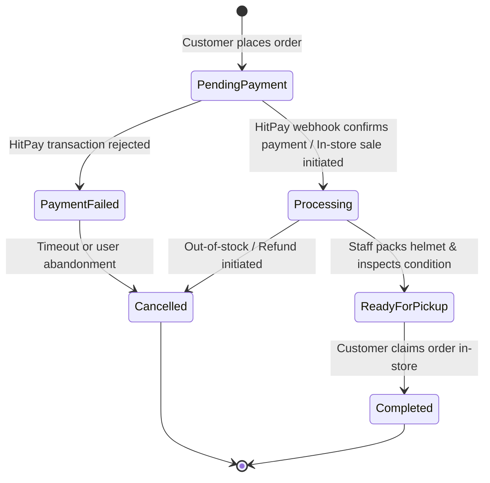

# Workflow: Order Fulfillment & Lifecycle Management

This document defines the end-to-end lifecycle of customer orders in the Helmet Cartel system, spanning online checkout, payment confirmation, staff preparation, pickup, and completion.

---

## 1. Order State Machine

---

## 2. Step-by-Step Execution Sequence

### Phase 1: Customer Order Initiation
1. Customer selects helmet variant (e.g. Shoei RF-1400, Size L, Matte Black).
2. Frontend verifies live stock via `GET /api/v1/inventory/{variantId}`.
3. Customer submits order at `POST /api/v1/orders`.
4. Server validates:
   - Item prices against active database catalog (reject client price tampering).
   - Stock availability.
5. System creates an order record in status `PendingPayment` and creates a HitPay checkout request.
6. Returns the HitPay redirect URL to the customer.

### Phase 2: Payment Confirmation & Real-Time Stock Locking
1. Customer completes payment via HitPay (GCash, PayMaya, Cards, QR PH).
2. HitPay dispatches an asynchronous webhook to `POST /api/v1/payments/hitpay-webhook`.
3. The server validates the HMAC-SHA256 signature against `HitPaySalt`.
4. Within a database transaction:
   - Order status transitions from `PendingPayment` to `Processing`.
   - Inventory is deducted atomically for each order item with `UPDLOCK, ROWLOCK`.
   - A `StockAuditLog` entry is written with reference to the Order ID.
5. SignalR broadcasts:
   - `InventoryHub.broadcastStockUpdate(variantId, newStock)`
   - `OrderHub.notifyNewOrder(orderDto)` to the staff dashboard.

### Phase 3: Staff Fulfillment & In-Store Pickup
1. Staff dashboard receives real-time notification with audio/visual prompt.
2. Staff retrieves physical helmet from stockroom, inspects box contents, and verifies accessories/visors.
3. Staff changes order status to `ReadyForPickup` via `PUT /api/v1/orders/{orderId}/status`.
4. An automated notification/email or SMS trigger is sent to the customer with pickup instructions.
5. Customer arrives in-store, presents Order Reference Number and ID.
6. Staff verifies identity, hands over helmet, and marks status as `Completed`.
