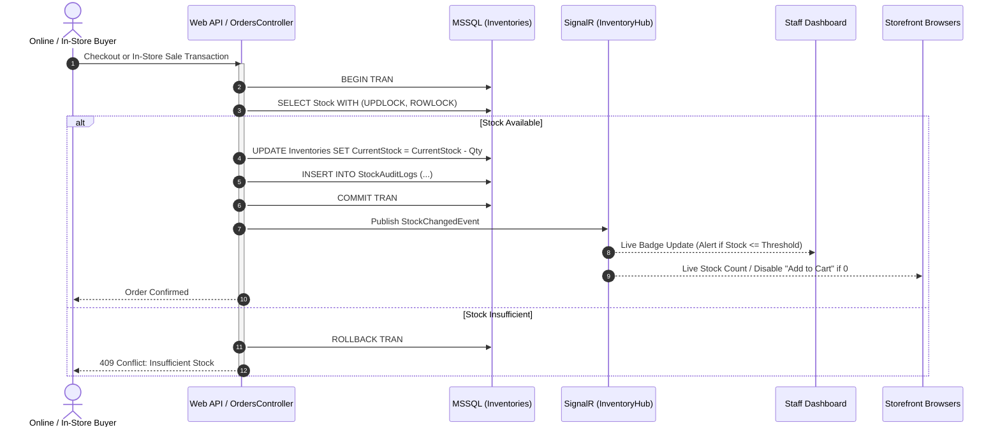

# Workflow: Real-Time Inventory Tracking & Stock Reconciliation

This document specifies how stock is tracked, locked, decremented, and synchronized in real-time across both online channels and physical in-store walk-in sales.

---

## 1. Architecture Flow

---

## 2. In-Store Walk-In Sale Processing
1. Staff opens the Quick In-Store Sale POS screen on the Staff Dashboard.
2. Staff scans or selects helmet model, size, and color.
3. System verifies real-time available stock.
4. Staff selects Payment Method: Cash, Card, or HitPay QR in-store terminal.
5. Order is submitted to `POST /api/v1/orders/in-store`.
6. Stock is immediately decremented in MSSQL; SignalR instantly updates the online storefront so an online buyer cannot purchase the same physical helmet simultaneously.

## 3. Low-Stock Alert System
- Threshold: When `CurrentStock <= ReorderPoint` (default: 3 units per variant), the system:
  1. Sets `IsLowStock = 1` in `Inventories`.
  2. Creates an unread notification record in `RestockAlerts`.
  3. Sends a real-time SignalR toast message to all logged-in Staff/Admin dashboards.
  4. Flags the item with an amber/red warning badge on the inventory management table.
