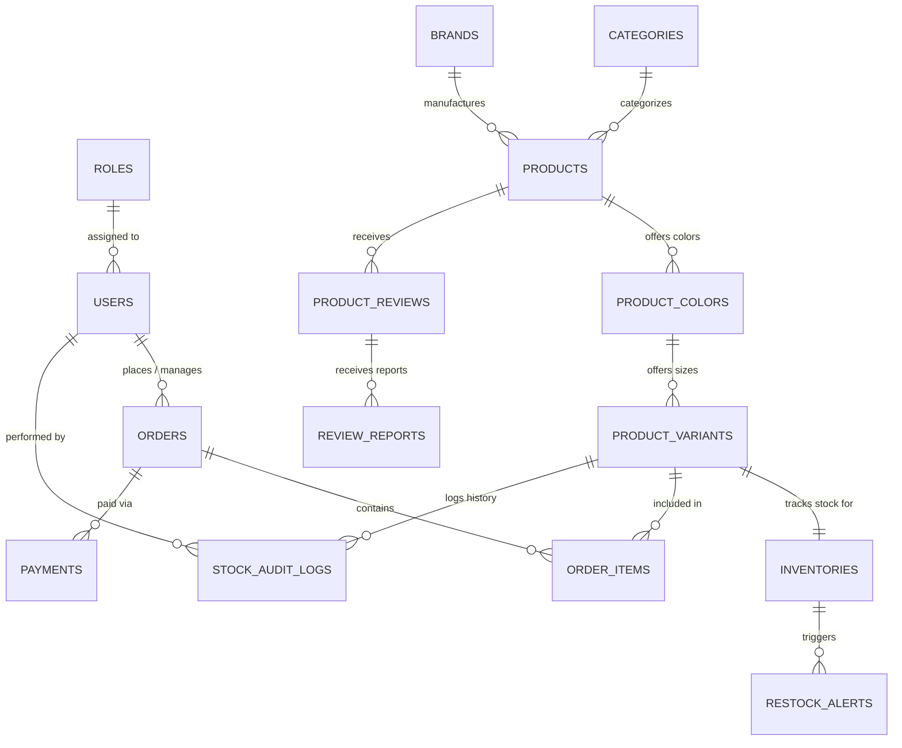

# Database Design & Architecture: Helmet Cartel

## Academic correction update (migrations 51–52)

Migration 51 supplies transactional order inventory changes, method-specific fulfillment transitions, owner-only cancellation, sale/restock audit entries, and order-related restock alerts. It distinguishes physical units (`CurrentStock`) from reserved units (`ReservedStock`). An order-specific negative `ONLINE_SALE` audit identifies stock already committed, preventing paid fulfillment/cancellation from touching another order's reservation. The existing cancellation trigger releases voucher usage within the same transaction.

Migration 52 supplies manual return/exchange processing and settled revenue views. Returns require approval, receipt, and recorded completion. Refunds are bounded by the discounted merchandise line; exchanges record zero refund and deduct an equal-price replacement's available units. A replacement must belong to the original product. Inspected sellable goods may be restocked once. Both original and replacement variants receive relevant audit/alert updates.

`v_SettledOrderRevenue` and `v_SettledSalesLines` provide consistent completed/delivered merchandise revenue after discounts and completed manual refunds. Shipping is excluded, exchange/approval amounts are not deducted, and completed payment rows are collapsed to one settlement per order. Completed returns remove the original line from net units sold.

The fresh installer includes structural changes through 52 but skips optional destructive demo cleanup 47. See `ACADEMIC_FIX_STATUS.md` for test coverage and the presentation's manual cancellation/refund boundaries. Gateway/simulation procedures were left unchanged.

## 1. Overview
The database layer for the Helmet Cartel Ordering and Management System is implemented on **Microsoft SQL Server (MSSQL)**. The schema is designed for strict referential integrity, ACID transactional consistency, real-time stock reconciliation, and complete auditability.

---

## 2. Entity Relationship Model (ERD)

---

## 3. Data Dictionary

### 3.1. `Roles` & `Users`
- **`Roles`**: `Id (PK, INT)`, `Name (NVARCHAR(50), UNIQUE)`, `Description (NVARCHAR(255))`.
- **`Users`**:
  - `Id (PK, INT IDENTITY)`
  - `RoleId (FK -> Roles.Id)`
  - `FullName (NVARCHAR(100))`
  - `Email (NVARCHAR(256), UNIQUE)`
  - `PasswordHash (NVARCHAR(512))`
  - `Salt (NVARCHAR(128))`
  - `PhoneNumber (NVARCHAR(30))`
  - `IsActive (BIT DEFAULT 1)`
  - `CreatedAt (DATETIME2)`, `UpdatedAt (DATETIME2)`

### 3.2. `Categories`, `Brands`, `Products`, `ProductColors`, `ProductVariants`
- **`Categories`**: `Id (PK)`, `Name (NVARCHAR(100))`, `Slug (NVARCHAR(100), UNIQUE)`, `Description (NVARCHAR(500))`.
- **`Brands`**: `Id (PK)`, `Name (NVARCHAR(100))`, `LogoUrl (NVARCHAR(255))`, `IsActive (BIT)`.
- **`Products`**:
  - `Id (PK, INT IDENTITY)`
  - `CategoryId (FK -> Categories.Id)`
  - `BrandId (FK -> Brands.Id)`
  - `Name (NVARCHAR(200))`
  - `Slug (NVARCHAR(220), UNIQUE)`
  - `Description (NVARCHAR(MAX))`
  - `RidingStyle (NVARCHAR(50))` -- e.g. "Sport/Track", "Urban/Casual", "Adventure/Touring", "Off-Road"
  - `BasePrice (DECIMAL(18,2))`
  - `DiscountPercentage (INT DEFAULT 0)`
  - `MainImageUrl (NVARCHAR(500))`
  - `IsActive (BIT DEFAULT 1)`, `CreatedAt (DATETIME2)`, `UpdatedAt (DATETIME2)`
- **`ProductColors`**: `Id (PK)`, `ProductId (FK -> Products.Id)`, `Color`, `ColorHex`; unique `(ProductId, Color)`.
- **`ProductVariants`**:
  - `Id (PK, INT IDENTITY)`
  - `ProductColorId (FK -> ProductColors.Id)`
  - `SKU (NVARCHAR(100), UNIQUE)`
  - `Size (NVARCHAR(20))` -- S, M, L, XL, XXL
  - `PriceAdjustment (DECIMAL(18,2) DEFAULT 0)`
  - `IsActive (BIT DEFAULT 1)`
  - Unique `(ProductColorId, Size)` prevents duplicate size variants.

Visible `Rating` and `ReviewCount` come from `ProductReviews` in catalog procedures. Hidden reviews do not contribute.

### 3.3. `Inventories`, `StockAuditLogs`, `RestockAlerts`
- **`Inventories`**:
  - `Id (PK, INT IDENTITY)`
  - `VariantId (FK -> ProductVariants.Id, UNIQUE)`
  - `CurrentStock (INT NOT NULL CHECK (CurrentStock >= 0))` -- Prevents negative inventory at engine level!
  - `ReservedStock (INT NOT NULL DEFAULT 0 CHECK (ReservedStock >= 0))`
  - `ReorderPoint (INT NOT NULL DEFAULT 3)`
  - `IsLowStock` is a persisted computed value based on available stock (`CurrentStock - ReservedStock`) and `ReorderPoint`.
  - `ReservedStock <= CurrentStock` is enforced.
  - `LastRestockedAt (DATETIME2)`
  - `UpdatedAt (DATETIME2 NOT NULL DEFAULT SYSUTCDATETIME())`
- **`StockAuditLogs`**:
  - `Id (PK, BIGINT IDENTITY)`
  - `VariantId (FK -> ProductVariants.Id)`
  - `UserId (FK -> Users.Id, NULLABLE for online checkout)`
  - `ChangeType (NVARCHAR(50))` -- 'ONLINE_SALE', 'INSTORE_SALE', 'RESTOCK', 'ADJUSTMENT', 'RETURN'
  - `PreviousStock (INT)`
  - `QuantityChanged (INT)`
  - `NewStock` is a persisted computed value: `PreviousStock + QuantityChanged`.
  - `ReferenceNumber (NVARCHAR(100))` -- Order number or supplier invoice
  - `Notes (NVARCHAR(500))`
  - `CreatedAt (DATETIME2 NOT NULL DEFAULT SYSUTCDATETIME())`
- **`RestockAlerts`**:
  - `Id (PK, INT IDENTITY)`
  - `InventoryId (FK -> Inventories.Id)`
  - `Severity (NVARCHAR(20))` -- 'LOW_STOCK', 'CRITICAL_ZERO'
  - `IsDismissed (BIT DEFAULT 0)`
  - `CreatedAt (DATETIME2)`

### 3.4. `Orders`, `OrderItems`, `Payments`, `HitPayWebhookLogs`
- **`Orders`**:
  - `Id (PK, INT IDENTITY)`
  - `OrderNumber (NVARCHAR(50), UNIQUE)` -- HC-YYYYMMDD-XXXX
  - `UserId (FK -> Users.Id, NULLABLE for guest checkout)`
  - `CustomerName (NVARCHAR(100))`
  - `CustomerEmail (NVARCHAR(256))`
  - `CustomerPhone (NVARCHAR(30))`
  - `OrderSource (NVARCHAR(30))` -- 'ONLINE', 'INSTORE_POS'
  - `Status (NVARCHAR(50))` -- 'PendingPayment', 'Processing', 'ReadyForPickup', 'Completed', 'Cancelled'
  - `Subtotal (DECIMAL(18,2))`
  - `DiscountAmount (DECIMAL(18,2) DEFAULT 0)`
  - `TotalAmount` is a persisted computed value: `Subtotal - DiscountAmount`.
  - `CreatedAt (DATETIME2 NOT NULL DEFAULT SYSUTCDATETIME())`
  - `UpdatedAt (DATETIME2)`
- **`OrderItems`**:
  - `Id (PK, INT IDENTITY)`
  - `OrderId (FK -> Orders.Id)`
  - `VariantId (FK -> ProductVariants.Id)`
  - `Quantity (INT CHECK (Quantity > 0))`
  - `UnitPrice (DECIMAL(18,2))`
  - `TotalPrice` is a persisted computed value: `Quantity * UnitPrice`.
- **`Payments`**:
  - `Id (PK, INT IDENTITY)`
  - `OrderId (FK -> Orders.Id)`
  - `PaymentGateway (NVARCHAR(50))` -- 'HitPay', 'Cash', 'Card_POS'
  - `GatewayReference (NVARCHAR(100))`
  - `Amount (DECIMAL(18,2))`
  - `Status (NVARCHAR(50))` -- 'Pending', 'Completed', 'Failed', 'Refunded'
  - `PaidAt (DATETIME2)`
- **`HitPayWebhookLogs`**:
  - `Id (PK, BIGINT IDENTITY)`
  - `HitPayPaymentId (NVARCHAR(100))`
  - `ReferenceNumber (NVARCHAR(100))`
  - `RawPayload (NVARCHAR(MAX))`
  - `SignatureReceived (NVARCHAR(256))`
  - `IsSignatureValid (BIT)`
  - `ProcessingStatus (NVARCHAR(50))` -- 'Processed', 'Rejected', 'Duplicate'
  - `CreatedAt (DATETIME2 DEFAULT SYSUTCDATETIME())`

---

## 4. Normalization and historical values

Product color and hex values belong to `ProductColors`, so sizes no longer repeat them. Review totals and report counts are calculated from their source rows. Computed totals prevent inconsistent arithmetic. `Orders.Subtotal`, `OrderItems.UnitPrice`, customer contact data, and payment amounts remain stored as order-time records, so later catalog or account changes do not alter purchase history. `sp_ValidateOrderTotals` checks that item totals match the stored subtotal before order creation commits.

## 5. Indexing & Optimization Strategy
1. `IX_Products_CategoryId` and `IX_Products_BrandId` for fast filtering.
2. `IX_Products_RidingStyle` for bento box and style navigation.
3. `UQ_ProductColors_Product_Color` and `UQ_ProductVariants_Color_Size` support product color and size lookups.
4. `IX_Inventories_IsLowStock` supports low-stock dashboard filtering.
5. The unique `Orders.OrderNumber` constraint supports cashier lookup.
6. `IX_StockAuditLogs_VariantId_CreatedAt` for inventory timeline audits.
7. Filtered unique indexes prevent duplicate open restock alerts and duplicate gateway references.
